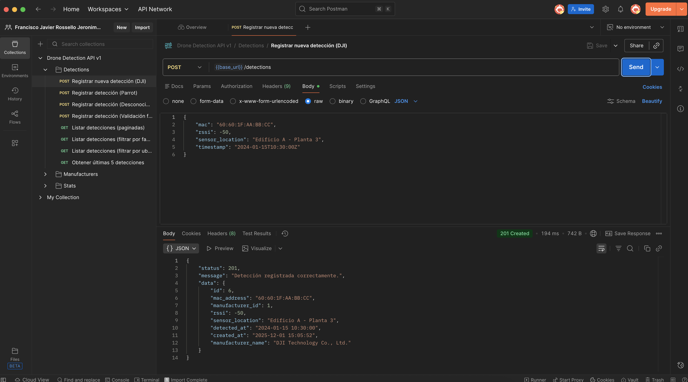
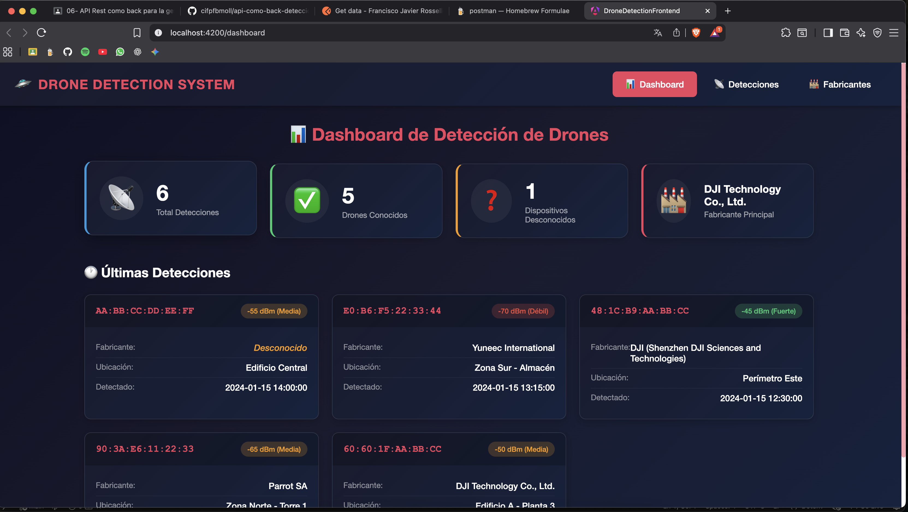

[](https://classroom.github.com/a/FpM8eaVc)

# 🛸 Sistema de Detección de Drones Wi-Fi

Sistema completo para la detección y monitorización de drones mediante análisis de direcciones MAC Wi-Fi. Incluye una **API REST** como backend y un **panel de control** desarrollado en Angular como frontend.

Basado en el artículo [Detección de Drones Wi-Fi](https://medium.com/@noko_kelevra/detecci%C3%B3n-de-drones-wi-fi-64b9cbdef2a6).

---

## 📋 Índice

- [Descripción](#-descripción)
- [Arquitectura del Sistema](#-arquitectura-del-sistema)
- [Capturas de Pantalla](#-capturas-de-pantalla)
- [Backend (API REST)](#-backend-api-rest)
- [Frontend (Angular)](#-frontend-angular)
- [Instalación y Configuración](#-instalación-y-configuración)
- [Tecnologías Utilizadas](#-tecnologías-utilizadas)
- [Autor](#-autor)

---

## 📝 Descripción

Este proyecto implementa un sistema de detección de drones que:

1. **Recibe datos de sensores**: Scripts de detección envían información sobre direcciones MAC detectadas vía Wi-Fi.
2. **Identifica fabricantes**: Mediante el análisis del OUI (Organizationally Unique Identifier) de las direcciones MAC.
3. **Proporciona estadísticas**: Dashboard con métricas en tiempo real sobre las detecciones.
4. **Panel de visualización**: Interfaz web intuitiva para usuarios no técnicos.

---

## 🏗 Arquitectura del Sistema

```
┌─────────────────┐     HTTP/JSON      ┌─────────────────┐
│                 │ ◄────────────────► │                 │
│    Frontend     │                    │     Backend     │
│    (Angular)    │                    │  (CodeIgniter)  │
│   Puerto 4200   │                    │   Puerto 8080   │
│                 │                    │                 │
└─────────────────┘                    └────────┬────────┘
                                                │
                                                ▼
                                       ┌─────────────────┐
                                       │     SQLite      │
                                       │   Base de Datos │
                                       └─────────────────┘
```

---

## 📸 Capturas de Pantalla

### Backend - API REST (Postman)


*Prueba de endpoints de la API REST usando Postman*

### Frontend - Panel de Control


*Panel de control mostrando las estadísticas y detecciones*

---

## 🔧 Backend (API REST)

### Requisitos del Sistema

- PHP 8.1 o superior
- Composer
- Extensiones PHP: `intl`, `mbstring`, `sqlite3`

### Estructura de la Base de Datos

#### Tabla `manufacturers`
| Columna | Tipo | Descripción |
|---------|------|-------------|
| id | INTEGER (PK) | Identificador único |
| oui | VARCHAR(8) | OUI del fabricante (ej: '60:60:1F') |
| name | VARCHAR(255) | Nombre del fabricante |
| created_at | DATETIME | Fecha de creación |
| updated_at | DATETIME | Fecha de actualización |

#### Tabla `detections`
| Columna | Tipo | Descripción |
|---------|------|-------------|
| id | INTEGER (PK) | Identificador único |
| mac_address | VARCHAR(17) | Dirección MAC completa |
| manufacturer_id | INTEGER (FK) | Referencia a manufacturers (nullable) |
| rssi | INTEGER | Intensidad de la señal |
| sensor_location | VARCHAR(255) | Ubicación del sensor |
| detected_at | DATETIME | Fecha/hora de detección |
| created_at | DATETIME | Fecha de creación del registro |

### Endpoints de la API

Base URL: `http://localhost:8080/api/v1`

| Método | Endpoint | Descripción |
|--------|----------|-------------|
| `POST` | `/detections` | Registra una nueva detección |
| `GET` | `/detections` | Lista paginada de detecciones |
| `GET` | `/detections/latest` | Últimas 5 detecciones |
| `GET` | `/manufacturers` | Lista de fabricantes conocidos |
| `GET` | `/stats` | Estadísticas del dashboard |

#### POST /detections
```json
// Request
{
    "mac": "60:60:1F:AA:BB:CC",
    "rssi": -50,
    "sensor_location": "Edificio A - Planta 3",
    "timestamp": "2024-01-15T10:30:00Z"
}

// Response (201 Created)
{
    "status": 201,
    "message": "Detección registrada correctamente.",
    "data": {
        "id": 1,
        "mac_address": "60:60:1F:AA:BB:CC",
        "manufacturer_id": 1,
        "rssi": -50,
        "sensor_location": "Edificio A - Planta 3",
        "detected_at": "2024-01-15 10:30:00",
        "manufacturer_name": "DJI Technology Co., Ltd."
    }
}
```

#### GET /stats
```json
// Response (200 OK)
{
    "status": 200,
    "data": {
        "total_detections": 1138,
        "known_drones_count": 820,
        "unknown_devices_count": 318,
        "top_manufacturer": "DJI Technology Co., Ltd."
    }
}
```

### Fabricantes Precargados

El sistema incluye OUIs de los siguientes fabricantes de drones:

| Fabricante | OUI |
|------------|-----|
| DJI Technology Co., Ltd. | 60:60:1F |
| DJI (Shenzhen) | 48:1C:B9 |
| DJI Innovation | 34:D2:62 |
| Parrot SA | 90:3A:E6 |
| Parrot Drones SAS | A0:14:3D |
| Yuneec International | E0:B6:F5 |
| Espressif Inc. | 24:62:AB |
| Raspberry Pi Foundation | B8:27:EB |

---

## 🎨 Frontend (Angular)

### Características

- **Dashboard**: Vista general con estadísticas y últimas detecciones
- **Gestión de Detecciones**: Lista completa con filtros y paginación
- **Registro de Detecciones**: Formulario para añadir nuevas detecciones manualmente
- **Catálogo de Fabricantes**: Información sobre fabricantes de drones conocidos
- **Diseño Responsive**: Adaptado a diferentes tamaños de pantalla
- **Tema Oscuro**: Interfaz moderna con colores corporativos

### Estructura de Componentes

```
drone-detection-frontend/
├── src/app/
│   ├── components/
│   │   ├── dashboard/       # Panel principal con estadísticas
│   │   ├── detections/      # Gestión de detecciones
│   │   ├── manufacturers/   # Lista de fabricantes
│   │   └── navbar/          # Barra de navegación
│   ├── models/              # Interfaces TypeScript
│   └── services/
│       └── api.ts           # Servicio de comunicación con el backend
```

### Rutas Disponibles

| Ruta | Componente | Descripción |
|------|------------|-------------|
| `/dashboard` | Dashboard | Panel principal |
| `/detections` | Detections | Lista de detecciones |
| `/manufacturers` | Manufacturers | Fabricantes conocidos |

---

## 🚀 Instalación y Configuración

### 1. Clonar el repositorio
```bash
git clone <url-del-repositorio>
cd api-como-back-detecciones-de-drones-y-desarrollo-de-un-front-XiscoRossello
```

### 2. Configurar el Backend

```bash
# Instalar dependencias PHP
composer install

# Copiar archivo de configuración
cp env .env

# Editar .env con la configuración de la base de datos
# CI_ENVIRONMENT = development
# app.baseURL = 'http://localhost:8080/'
# database.default.database = /ruta/completa/writable/database.sqlite
# database.default.DBDriver = SQLite3

# Crear archivo de base de datos
touch writable/database.sqlite

# Ejecutar migraciones
php spark migrate --all

# Poblar base de datos con fabricantes
php spark db:seed ManufacturerSeeder

# Iniciar servidor backend
php spark serve
```

El backend estará disponible en: `http://localhost:8080`

### 3. Configurar el Frontend

```bash
# Navegar al directorio del frontend
cd drone-detection-frontend

# Instalar dependencias
npm install

# Iniciar servidor de desarrollo
npm start
```

El frontend estará disponible en: `http://localhost:4200`

---

## 🛠 Tecnologías Utilizadas

### Backend
- **Framework**: CodeIgniter 4.6
- **Lenguaje**: PHP 8.1+
- **Base de Datos**: SQLite3
- **API**: REST con JSON

### Frontend
- **Framework**: Angular 19
- **Lenguaje**: TypeScript
- **Estilos**: SCSS
- **HTTP Client**: Angular HttpClient

### Herramientas de Desarrollo
- **Testing API**: Postman
- **Control de Versiones**: Git
- **IDE**: Visual Studio Code

---

## 📦 Colección Postman

Se incluye el archivo `Drone_Detection_API.postman_collection.json` con todos los endpoints configurados para pruebas.

**Cómo importar:**
1. Abrir Postman
2. File → Import
3. Seleccionar el archivo `Drone_Detection_API.postman_collection.json`

---

## 📚 Comandos Útiles

### Backend (CodeIgniter)
```bash
php spark serve              # Iniciar servidor
php spark migrate --all      # Ejecutar migraciones
php spark migrate:rollback   # Revertir migraciones
php spark db:seed ManufacturerSeeder  # Ejecutar seeder
php spark routes             # Ver rutas disponibles
```

### Frontend (Angular)
```bash
npm start                    # Iniciar servidor de desarrollo
npm run build                # Compilar para producción
ng generate component <nombre>  # Crear nuevo componente
ng generate service <nombre>    # Crear nuevo servicio
```

---

## 👤 Autor

**Xisco Rosselló**

Proyecto desarrollado para los módulos de:
- Desarrollo Web en Entorno Servidor
- Desarrollo Web en Entorno Cliente
- Diseño de Interfaces

CIFP Francesc de Borja Moll - 2º DAW - Curso 2024/2025

---

## 📄 Licencia

Proyecto educativo - Todos los derechos reservados
